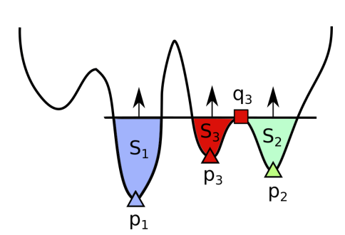

# BarcodeCalc



## Contents


- [Description](#description)
- [Requirements](#requirements)
- [Building](#building)
- [Usage](#usage)
- [License](#license)
- [Contact](#contact)

## Description

Small package for calculating zero persistent homology of sublevel set filtration of a function. 
It is based on the algorithm from article 
<a href="https://arxiv.org/abs/1912.00043">Barcodes as summary of objective function's topology</a>.

The algorithm works with function’s values on a randomly sampled or specifically chosen set of points. 
The local minima give birth to clusters of points in sublevel sets.
The algorithm works by looking at neighbors of each point with lower value of the function and deciding if this point 
belongs to the existing clusters, gives birth to a new cluster (minimum), or merges two or more clusters (index one saddle). 
Algorithm has complexity of O(n log(n)), where n is the cardinality of the set of points.

## Requirements

* **C++17:** Robust support for most language features.
* **Boost:** Boost.Asio and some other parts of Boost.
* **python3:** To use python version

When using Microsoft Visual C++, Visual Studio 2017 or later is required.

One of these components is required in order to build the tests and examples:

* CMake 3.5.1 or later (Windows only)


## Building

To run c++ implementation you should install c++17. Simply run 

``` bash
g++ -o sublevel sublevel.cpp
```

Then run the code:

``` bash
./sublevel
```

To use python version you can run setup:

``` bash
CFLAGS=-stdlib=libc++ python3 setup.py build
```

## Usage

You can find examples of usage in notebooks. The notebooks [`test`](notebooks/test.ipynb) and [`example`](notebooks/Example.ipynb) provide you with the basics.

## License

All our code and modifications are licensed under the attached MIT License.

## Contact

Please feel free to reach out if there are any questions, suggestion or issues with the code. You can contact daniil.emtsev.ig@gmail.com, d.oganesyan@skoltech.ru


Please consider citing our work if you use any of the ideas presented the paper or code from this repo:

```
@misc{barannikov2020barcodes,
      title={Barcodes as summary of objective function's topology}, 
      author={Serguei Barannikov and Alexander Korotin and Dmitry Oganesyan and Daniil Emtsev and Evgeny Burnaev},
      year={2020},
      eprint={1912.00043},
      archivePrefix={arXiv},
      primaryClass={cs.LG}
}
```


